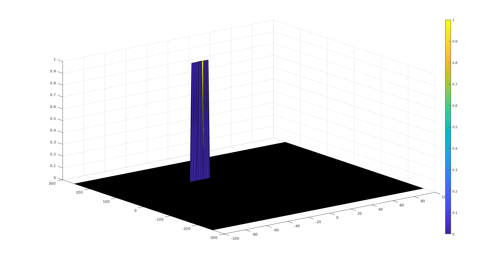

Sensor Fusion Nanodegree - Radar Target Generation and Detection
================================================================

In this document we summarize the work done for the Radar Target Generation
and Detection Project, specifying how the different points in the rubric are
fulfilled.


FMCW Waveform Design
--------------------
```
Using the given system requirements, design a FMCW waveform.
Find its Bandwidth (B), chirp time (Tchirp) and slope of the chirp.
```

The parameters are computed given the system requirement, as follows:

```matlab
Bandwidth = speed_of_light / (2.0 * range_resolution);  % [Hz]
Tchirp = 5.5 * 2.0 * max_range / speed_of_light;  % [s]
Slope = Bandwidth / Tchirp;
```

We obtain the following values:

```
Bandwidth = 150 MHz
Tchirp = 7.33 us
Slope = 2.045e13 Hz/s
```

Simulation Loop
---------------
```
Simulate Target movement and calculate the beat or mixed signal for every timestamp.
```

A constant velocity model has been implemented as follows:

```matlab
% Update the Range of the Target for constant velocity.
r_t(i) = target_initial_range + target_initial_velocity * t(i);
td(i) = 2.0 * (r_t(i) / speed_of_light);  % Round-trip time delay between transmitted and received signal
```

Where `r_t` is the range of the target at each timestamp and `td` is the time
delay of the round-trip of signal hitting the target.

The transmited and received signal are computed as follows:

```matlab
% Update the transmitted and received signal.
Tx(i) = cos(2*pi*(fc*(t(i)        ) + 0.5*Slope*(t(i)        )^2));
Rx(i) = cos(2*pi*(fc*(t(i) - td(i)) + 0.5*Slope*(t(i) - td(i))^2));
```

Finally, the mixed or beat signal is computed as the product of the previous two:

```matlab
Mix(i) = Tx(i) * Rx(i);
```

Range FFT (1st FFT)
-------------------
```
Implement the Range FFT on the Beat or Mixed Signal and plot the result.
```

The range FFT is computed as follows:

```matlab
% Reshape the vector into Nr*Nd array. Nr and Nd here would also define the size of
% Range and Doppler FFT respectively.
Mix_matrix = reshape(Mix, Nr, Nd);

% Run the FFT on the beat signal along the range bins dimension (Nr) and
% normalize.
fft_range = fft(Mix_matrix, Nr, 1) / Nr;

% Take the absolute value of FFT output
fft_range_abs = abs(fft_range);

% Output of FFT is double sided signal, but we are interested in only one side of the spectrum.
% Hence we throw out half of the samples.
fft_range_abs_half = fft_range_abs(1 : Nr / 2, :);
```

The following plot is obtained for `t = 0` (i.e. first column of
`fft_range_abs_half`):


We can observe a peak at the target position (110 meters).

2D CFAR
-------
```
Implement the 2D CFAR process on the output of 2D FFT operation, i.e the Range
Doppler Map.
```

The 2D CFAR process was implemented, obtaining the following result:



**Implementation steps for the 2D CFAR process**

The 2D CFAR is implemented as follows:

```matlab
for i = Tr+Gr+1 : size(RDM, 1) - (Tr+Gr)
    for j = Td+Gd+1 : size(RDM, 2) - (Td+Gd)
        % Add noise level for all training cells (in Watt, not dBm)
        for p = i-(Tr+Gr) : i+(Tr+Gr)
            for q = j-(Td+Gd) : j+(Td+Gd)
                if abs(i - p) > Gr || abs(j - q) > Gd
                    noise_level = noise_level + db2pow(RDM(p, q));
                    n_training_cells = n_training_cells + 1;
                end
            end
        end

        % Compute average and convert back to dbM
        noise_level_avg_dbm = pow2db(noise_level / n_training_cells);

        % Compute threshold
        threshold = noise_level_avg_dbm + offset;

        % Store into output
        if (RDM(i, j) > threshold)
            RDM_after_CFAR(i, j) = 1;
        end
    end
end
```

It can be summarized as follows:

1. Loop over the entire `RDM` matrix containing the 2D FFT.
   - Since we cannot compute the output at the edges, the loop starts
     at `i = Tr + Gr + 1` and finishes at `i = Nr/2 - (Tr + Gr)`.
     The same applies on the vertical axis over `j`, taking into
     account the training and guard cells for the `doppler` dimension.
2. The coordinates `(i, j)` represent the `CUT` (cell under test).
3. Then, create another 2 loops (over `p` and `q`) that go around the
   CUT and compute an average of the noise level. This is computed only
   for the training cells, as shown by the condition:

   ```matab
   if abs(i - p) > Gr || abs(j - q) > Gd
   ```

4. The `noise_level` is previosly initialized to 0, and at each iteration
   of the loop we add the noise level of the training cell under consideration.
   In order to be able to add power levels, we need to convert from dBm to W,
   via the `db2pow` function. We also keep track of the number of traning
   cells `n_training_cells` to make the average later on.

5. Once the two inner for loops over `p` and `q` are done, we can compute
   the average noise by dividing `noise_level` over `n_training_cells`.

6. Next, we convert that average noise into dBm with `pow2db` to obtain
   `noise_level_avg_dbm`.

7. We compute the `threshold` level as `noise_level_avg_dbm + offset`.

8. Finally, we set the output `RDM_after_CFAR(i,j)` to 1 if its level is larger
   than the threshold.

**Selection of Training, Guard cells and offset**

- **Training cells**: we used `Tr = 10, Td = 8` as suggested in the lectures.
  We need a high enough number to obtain a good estimate of the noise, but
  at the same time small enough to make the computation time feasible.

- **Guard cells**: we used `Gr = 4, Gd = 4` as suggested in the lectures.
  This gives a good protection in case the real signal from the CUT leaks
  into neighboring cells, and at the same time is small enough so that
  we can use more remaining cells as training cells and obtain a better
  estimate of the noise.

- **Offset**: we started with offset = 6 dB as suggested in the lectures,
  but that wasn't enough to obtain a crisp signal as shown in the project
  description. Increasing it to `offset = 10 dB` yielded the desired result.

**Steps taken to suppress the non-thresholded cells at the edges**

Since we need to compute the average noise over a small window around the
CUT, we cannot compute it where the window lies outside the 2D FFT matrix.
Therefore cells on the edges are not considered in the loop.

The only step needed to suppress the non-thresholded cells at the edges
is simply to **initialize the output `RDM_after_CFAR` to all zeros** before
computing the 2D CFAR. Only thresholded cells will obtain a value of 1
afterwards.

README file
-----------
```
Create a CFAR README File.
```
This README file explains the implementation of all aspects of the project.
